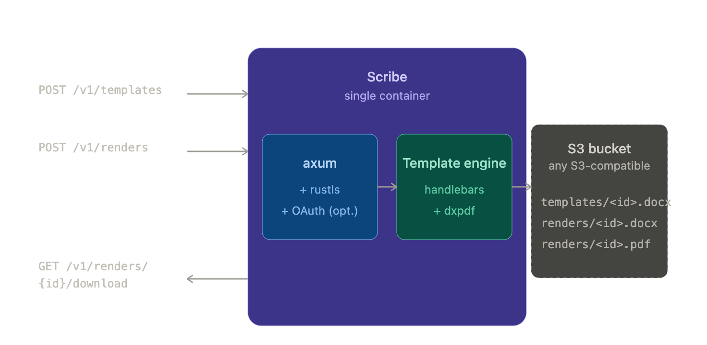

# Rendrr

**Rendrr turns a Word document into an API.**

Author a `.docx` in Word and type `{{customer_name}}` wherever a value should
go. Upload it once, then POST JSON whenever you need a document — you get back
a finished `.docx` or PDF with the original layout, fonts, and styling intact.

Self-hosted: one Rust binary, one Docker image. Your documents and data never
leave your infrastructure.

📖 **[Documentation](https://portside-labs.github.io/rendrr/)** ·
[Getting started](https://portside-labs.github.io/rendrr/getting-started) ·
[Template syntax](https://portside-labs.github.io/rendrr/template-syntax) ·
[API reference](https://portside-labs.github.io/rendrr/api-reference)



## Features

- **DOCX templating** with `{{variable}}`, `{{user.name}}`, `{{#each}}`,
  `{{#if}}`, `{{#table}}`, `{{#image}}`, and `{{#chunk}}` helpers, in the
  document body as well as headers and footers.
- **In-process PDF output** via [`dxpdf`][dxpdf] — no extra third party
  services.
- **Optional OAuth 2.0 / OIDC** bearer-token authentication. Plug in any
  OIDC IdP (Auth0, Okta, Keycloak, Cognito, Google, Azure AD, ...) by setting a
  single env var.
- **Optional native TLS** via rustls — point at PEM cert/key files on disk.
- **S3-compatible storage** — AWS S3, MinIO, R2, B2, GCS, etc.
- Single statically-linked Rust binary, ships as one Docker image.

## Run it

The supported way to run Rendrr is via the published Docker image. No Rust
toolchain or build dependencies required on the host.

```bash
docker run -d \
  --name rendrr \
  --restart unless-stopped \
  -p 3000:8080 \
  --env-file ./rendrr.env \
  ghcr.io/portside-labs/rendrr:latest
```

A minimum `rendrr.env` only needs the eight `*_BUCKET_*` variables — see
[`.env.example`](.env.example) for the full list. Tagged release images are
published to GHCR on every `v*` tag.

### Try it locally in one command

The [Getting Started guide](https://portside-labs.github.io/rendrr/getting-started)
in the docs has a self-contained `docker-compose.yml` that brings up Rendrr
together with a local MinIO bucket — paste, `docker compose up -d`, done.

> Note: the `docker-compose.yml` in **this repo** is for contributors only
> (it brings up just MinIO so you can run Rendrr via `cargo run`). The
> end-user compose recipe lives in the docs.

## Configuration

All configuration is by environment variable. See [`.env.example`](.env.example)
for the full list. The minimum is the two storage configurations:

| Variable                              | Purpose                                |
| ------------------------------------- | -------------------------------------- |
| `TEMPLATE_BUCKET_NAME`, `*_REGION`, ... | Where uploaded templates are stored.   |
| `RENDER_BUCKET_NAME`, `*_REGION`, ...   | Where rendered documents are written.  |
| `PORT`                                | HTTP/HTTPS listener port (default 3000). |

### PDF output

PDF rendering happens in-process using [`dxpdf`][dxpdf], a Skia-backed
DOCX→PDF converter. It's enabled out of the box — clients request it
per-render via `"output_format": "pdf"`.

Known dxpdf limitations: justify text alignment, footnotes/endnotes, tracked
changes, comments, multi-column layout, complex SmartArt, and charts may not
render exactly as Word displays them. Good for invoices/letters/reports;
careful evaluation needed for complex documents.

### Enabling OAuth 2.0 authentication

Set `OAUTH_ISSUER` to your IdP's issuer URL. The server will discover the
JWKS endpoint via `.well-known/openid-configuration` and validate every
incoming `Authorization: Bearer <jwt>` against it.

```
OAUTH_ISSUER=https://auth.example.com/
OAUTH_AUDIENCE=rendrr-api
OAUTH_ALLOWED_CLIENT_IDS=client-a,client-b   # optional allowlist
OAUTH_JWKS_URL=https://...                   # optional, defaults to OIDC discovery
```

When OAuth is enabled, each endpoint requires a specific scope in the token's
`scope` (or `scp`) claim. Scope names are always prefixed with `rendrr` to
avoid colliding with existing scopes in your IdP; the separator between
segments is configurable via `RENDRR_SCOPE_SEPARATOR` (allowed: `:`, `.`, `/`).

| Endpoint                                  | Required scope (default `:`)  |
| ----------------------------------------- | ----------------------------- |
| `POST /v1/templates`                      | `rendrr:templates:write`      |
| `DELETE /v1/templates/{template_id}`      | `rendrr:templates:delete`     |
| `POST /v1/renders`                        | `rendrr:renders:write`        |
| `GET /v1/renders/{render_id}/download`    | `rendrr:renders:read`         |

A request whose token is missing the required scope returns
`403 Permission denied: Token is missing required scope '<name>'`. See
[the OAuth docs](https://portside-labs.github.io/rendrr/oauth) for more.

Without `OAUTH_ISSUER` the service runs unauthenticated — only safe behind a
trusted network or another authenticating proxy.

### Enabling TLS

Provide PEM-encoded cert and key files:

```
TLS_CERT_PATH=/etc/rendrr/tls/fullchain.pem
TLS_KEY_PATH=/etc/rendrr/tls/privkey.pem
```

The server will bind HTTPS only on `PORT` when both are set. Mount your certs
into the container at those paths and the service handles termination
directly — no reverse proxy needed for TLS alone.

## API

Five endpoints, fully documented in [`docs/public/openapi.yaml`](docs/public/openapi.yaml):

| Method   | Path                                  | Purpose                             |
| -------- | ------------------------------------- | ----------------------------------- |
| `POST`   | `/v1/templates`                       | Upload a DOCX template.             |
| `DELETE` | `/v1/templates/{template_id}`         | Delete a template.                  |
| `POST`   | `/v1/renders`                         | Render a template with JSON data.   |
| `GET`    | `/v1/renders/{render_id}/download`    | Stream the rendered DOCX or PDF.    |
| `GET`    | `/health`                             | Liveness probe (no auth required).  |

Template syntax is documented in [the template syntax guide](https://portside-labs.github.io/rendrr/template-syntax).

## Contributing

See [CONTRIBUTING.md](CONTRIBUTING.md) for the local development loop,
build-from-source requirements, and how to run the test suite.

## License

MIT — see [LICENSE](LICENSE).

## Security

See [SECURITY.md](SECURITY.md) for reporting and operational hardening notes.

[dxpdf]: https://crates.io/crates/dxpdf
